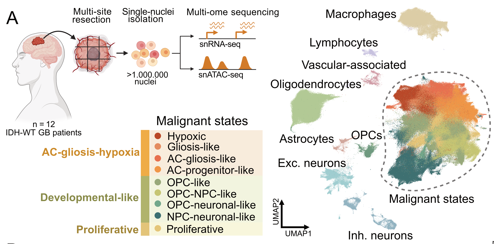

# GBM analysis

Analysis code for **Decoding Plasticity Regulators and Transition Trajectories in
Glioblastoma with Single-cell Multiomics** — Saraswat M, Rueda-Gensini L,
Heinzelmann E, Gracia T, Memi T *et al.*

> **If you use code from this repository, please cite our paper**
> Much of the analysis here is
> downstream of scDoRI ([bioFAM/scDoRI](https://github.com/bioFAM/scDoRI)). See [Citation](#citation).

For data, see [Data availability](#data-availability).

---

## Contents

| | | data it reads |
|---|---|---|
| `TAP_TRS_analysis.ipynb` | Topic activation potential (TAP), topic repression score (TRS), net topic transitions, contribution of epigenetic priming, state-level regulation | `data/` only |
| `plot_supp_peak_object.ipynb` | Peak-level panels: peak-topic UMAPs, accessibility per state, TF binding, gene–peak links | Zenodo peak AnnData |
| `plasticity_analysis.ipynb` | Epigenetic plasticity — entropy of ATAC-based cell-state classifier probabilities | ArrayExpress metacell objects |
| `python_scripts/topic_regulation.py` | Module behind the TAP/TRS notebook: TF activity scoring, topic- and state-level regulation potentials, target-topic scaling, randomised backgrounds | — |
| `tf_screen/` | 55-TF overexpression screen pipeline, Fig. 3 and ED Fig. 5 — [own README](tf_screen/README.md) | GEO |

**Only `TAP_TRS_analysis.ipynb` runs from the repository alone.** Everything it needs is
in `data/`. The other two notebooks read objects that are too large for git and must be
downloaded first — the peak AnnData from Zenodo, the metacell objects from ArrayExpress.

### Requirements

Python 3.10+ with `numpy`, `pandas`, `scipy`, `scikit-learn`, `matplotlib`, `seaborn` and
`tqdm`. `TAP_TRS_analysis.ipynb` needs nothing beyond these.

Use **pandas < 3**. `python_scripts/topic_regulation.py` relies on chained assignment
(`df[col][mask] = 0`), which pandas 3 turns into a silent no-op under copy-on-write; the
`act_thresh` filter then stops taking effect and the state-level cells fail. The published
results were produced with pandas 2.x.

---

## TAP/TRS inputs

All files below are in `data/` and are read directly by `TAP_TRS_analysis.ipynb`.

| file | shape | role |
|---|---|---|
| `data/01_scdori_grn_activator_atac.npz` | 50 topics × 195 TFs × 3,192 genes | activating TF→gene links per topic (ATAC-based) |
| `data/01_scdori_grn_repressor_finetuned.npz` | 50 topics × 195 TFs × 3,192 genes | repressing TF→gene links per topic (fine-tuned) |
| `data/02_scdori_topic_tf_activity_activator.csv` | 50 topics × 195 TFs | activator TF activity per topic |
| `data/02_scdori_tf_expression_by_topic.csv` | 195 TFs × 20 topics | mean scaled TF expression per topic |
| `data/02_scdori_tf_geneactivity_by_topic.csv` | 195 TFs × 20 topics | mean scaled TF gene activity score (ATAC based accesibility) per topic |
| `data/02_scdori_topic_gene_matrix_selected31.csv` | 3,192 genes × 31 topics | topic-gene loadings; also supplies the gene order of the GRN tensors |
| `data/02_scdori_mean_topics_activation_coarse_states.tsv` | 5 states × 50 topics | topic activity per coarse state, for the state-level analysis |
| `data/04_TAP_random_background.csv` | 342 topic pairs × 1,000 permutations | null distribution of TAP values |
| `data/04_TRS_random_background.csv` | 342 topic pairs × 1,000 permutations | null distribution of TRS values |

Each `.npz` stores its own `topics`, `tfs` and `genes` label arrays next to `grn`

### Significance

The permutation nulls are shipped precomputed, so **significance masking runs in seconds** — the
notebook loads the two `04_*_random_background.csv` files and zeroes any topic pair whose
value falls below the 95th percentile of its own null. Recomputing the nulls from scratch
(`compute_significance=True`, 1,000 randomisations per topic pair) takes hours and is not
needed to reproduce the figures.

The 342 rows are the ordered pairs of **19** topics — the 17 analysed plus Topics 31 and
39 — with self-pairs excluded. The notebook subsets them to the 17 topics
it plots. Row order is significant: the notebook reshapes the column of thresholds into a
19 × 18 matrix, so the rows must stay in the file's original order.

---

## Data availability

| Archive | Accession | Contents |
|---|---|---|
| Web portal | [www.gbmspace.org](https://www.gbmspace.org) | Interactive browser for the processed multiome atlas |
| ArrayExpress | `E-MTAB-17183` | Processed snRNA-seq and snATAC-seq AnnData; metacell-level RNA counts and ATAC gene scores (plasticity analysis) |
| EGA | `EGAD00001015526` | Raw multiome sequencing data (controlled access) |
| GEO | `GSE294518` | All remaining NGS data, including the TF screen |
| Zenodo | `<ZENODO DOI>` | scDoRI regulatory output + SCENIC+ comparison networks |

Reference genome: hg38 (GRCh38).

Zenodo is the citable archive. It holds the same TAP/TRS inputs that are committed here,
plus everything too large for git, and has its own `00_README.md`:

- Three scDoRI GRN tensors (ATAC-based activator, fine-tuned activator, fine-tuned
  repressor), each 50 topics × 195 TFs × 3,192 genes, as `.npz` — plus the same links as
  one edge-list table. Only the first and third are needed here; the fine-tuned activator
  is Zenodo-only
- Topic-level matrices: topic-gene loadings, TF activity per topic, TF expression and gene
  activity per topic, topic activity per coarse state, topic annotation
- SCENIC+ networks (global + nine per cell type) and per-topic AUCell enrichment
- Peak AnnData: 182,677 peaks × 195 TFs — in-silico ChIP binding, peak-topic activity,
  accessibility per state, peak UMAP, gene–peak links

---

## Things to keep in mind

**Two activator GRNs, not interchangeable.** The ATAC-based one is not fine-tuned against
TF–gene expression and is what TAP uses; the fine-tuned one is anchored to observed
expression.

**Repressor weights are negative.** In both the GRN tensors and the peak object.
Percentile colour limits applied naively will highlight the weakest sites.

**Raw TF binding is not comparable between TFs.** Standardise with the per-TF mean and sd
stored in the peak object before comparing factors.

**`scale_topic_regulation_target_topic` modifies its input in place.** It divides each row
by the number of TFs expressed in that source topic before scaling columns, so calling it
twice on the same object double-normalises. The notebook recomputes the raw matrix before
each call for this reason.

---

## Citation

> <FULL PAPER CITATION Upcoming, Nature 2026>

## License

MIT — see [LICENSE](LICENSE). Zenodo data is CC BY 4.0.

## Contact

Open an issue, or contact `manu.saraswat AT dkfz.de` or `laura.ruedagensini AT dkfz.de`
